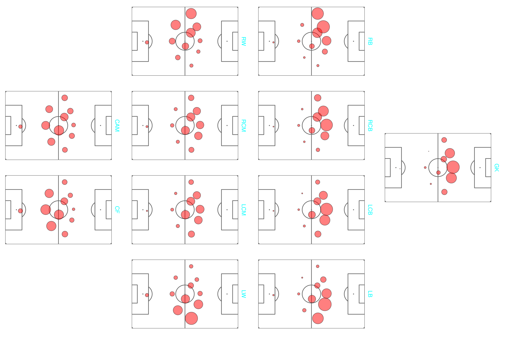
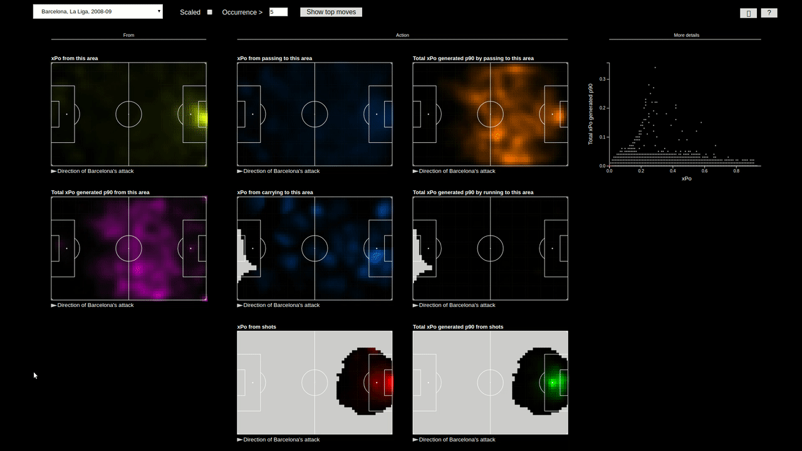
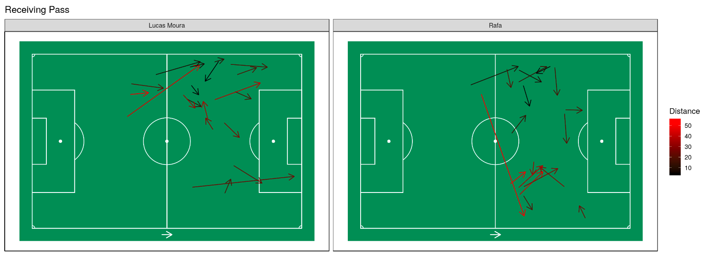

This page lists some projects I've enjoyed working on in the past few years.

I'm a data scientist and in my own time I enjoy working on data science related projects in football ( soccer. ) I mostly use R and sometimes D3js and Python, along with some other tools.

I'd love to take up some projects in professional football! If you're interested in collaborating, using some of this code, or have an idea or project in mind that you'd like my help on, feel free to connect with me on mail - mail dot thecomeonman at gmail dot com, or find me on [Twitter](twitter.com/thecomeonman) or e-mail me at mail dot thecomeonman at gmail dot com. Interesting non-football data science projects are also welcome!

## Football related community resources

### [Coda Bonito](https://github.com/thecomeonman/CodaBonito)

Plot sonars  | Performance lanes | Pitch control
:----------: | :---------------: | :-----------:
 |  | 

xG build up | Football pitch | Radars 
:---------: | :------------: | :----: 
 |  | 

An R library that has some football analysis and visualisation helper functions.

### [POV - a ggplot friendly 3D manipulation library](https://github.com/thecomeonman/POV)

An R library with low level code which can be used to generate visuals like this -

[Another video of Thiago's passing](https://twitter.com/thecomeonman/status/1310564531664429057)

[Aguero's EPL career](https://twitter.com/thecomeonman/status/1379404586973298691)

### [Making friends with tracking data](https://github.com/thecomeonman/MakingFriendsWithTrackingData)

A demo of some tracking data related helper functions. Most of the underlying code is 
available in my [CodaBonito R library](https://github.com/thecomeonman/CodaBonito).

Done in R. Methodology and example code included.

## Football models and visualisations

### [Quantifying defensive contribution from tracking data](https://thecomeonman.github.io/DefensiveInteractionsFromTrackingData/)

A model to quantify the impact of a player on preventing goals, passes, and carries from happening.

[Stats Preform Pro Forum 2021 Talk](https://vimeo.com/533973203)

[Friends of Tracking talk](https://www.youtube.com/watch?v=Imt8p7ZgnZQ)

[Article in SpaceSpaceSpace](https://spacespacespaceletter.com/whats-tackles-defense-is-about-denying-space/)

[Article in Analytics FC Blog](http://analyticsfc.co.uk/blog/2021/04/26/quantifying-defence-pass-prevention-and-shot-prevention/)

### [Moving from outcome based models to intent based models](https://thecomeonman.github.io/IntentVsOutcome/)

Pass related models, such as pass success probability and pitch control, usually implicitly assume that a pass would precisely reach a target coordinate. However, we need to account for the fact that sometimes, and probably very often, the player may intend to pass to a particular location but may pass somewhere in the neighbourhood of that location and not exactly at that location.

Done in R. Methodology included.

### [Player profile visualisations](https://github.com/thecomeonman/PlayerProfileVizes)

### xPo: a framework to value football actions

An action value measurement framework to evaluate the contributions of players who aren't the ones registering assists or scoring goals. The same concept can also be expanded to fit to defensive actions. 

This concept and the dashboard won an honourable mention at the Seattle Sounders Analytics Competition 2020.

- [A post explaining how it works](https://thecomeonman.github.io/xPo) with some EPL teams and players analysed
- [A dashboard which you could use to analyse a team](https://thecomeonman.github.io/xPoDashboard) built on data from Barcelona's 2008-09 season data from Statsbomb

Two of the observations from the dashboard is Barcelona's preference to attack from the right and Dani Alves' strong contributions to their attack. 

Done in R, D3js. Methodology and sample code included.

### [Player similarity / replacement based on aggregated match level data](https://thecomeonman.github.io/PlayerSimilarityFromAggregatedData)

Built a model to identify players with similar or better profiles. Built an interactive visualisation around it to understand various aspects of the player better.

In the linked post above, I analyse multiple players amongst the transfer rumours at the point and anecdotally validate the model with some of the results that show up, eg. Fernandinho's list has pretty much every player whom Guardiola has either played in the same position earlier or was rumoured to be interested in buying - Alcantara, Jorginho, Busquets, and Rodri, amongst others who have similar playing styles. I keep updating the model and some of the most recent runs are on (this thread for some transfers during the summer transfer window of 2020)[https://twitter.com/thecomeonman/status/1306654311661760512]

Done in R, D3js. D3js code included.

### [Playing style similarity based on spatial data from passes](https://thecomeonman.github.io/SpatialSimilaritiesBetweenPlayers)

Built a model to identify similar player or team styles depending on the way passes are made and received.

Amongst other things, I used it to [evaluate whether Liverpool choosing to practice against Benfica for their UCL 2019 final against Spurs made sense](https://thecomeonman.github.io/SpursBenficaSimilarityByLiverpool). The same method can be extended to compare and identify similar playing styles for any other team.

Some other applications of this model:
- [Deriving player roles](https://thecomeonman.github.io/SpatialSimilaritiesBetweenPlayers/PlayerRoles)
- [Finding players in similar roles - detailed version](https://thecomeonman.github.io/SpatialSimilaritiesBetweenPlayers/SimilarPlayers.html)
- [Finding players in similar roles - short version](https://thecomeonman.github.io/SpatialSimilaritiesBetweenPlayers/TeamHighLevel201819/ManCity.html)

Done in R. Methodology included.

### [xG Infographics](https://github.com/thecomeonman/xGInfographics)

Countering the over-simplified xG based interpretations with a detailed infographic.

Done in R.

### [What Changed at Manchester City From 2016-17 to 2017-18](https://thecomeonman.github.io/MCI-2016-17-To-2017-18)

Compared some things that changed at Manchester City between their hohum 2016-17 season and multiple record breaking 2017-18 season.

Done in Python. Methodology included.

### [Adhoc analysis of the 2013 FPL season](https://github.com/thecomeonman/FPL)

A very unorganised set of posts from way back where I analyse fantasy football data.

Done in R. Methodology included.

## Others

### [Clustering using recursive division](https://github.com/thecomeonman/CURD)

We consider the problem of clustering categorical datasets, with a view to arrive at simple, easily interpretable clusters. We propose CURD, a recursive partitioning algorithm that expresses clusters as leaf nodes of a decision tree. 

[Link to paper](https://www.researchgate.net/publication/338004913_CURD_A_recursive_partitioning_algorithm_for_clustering_categorical_datasets)

Done in R. Methodology and code included.

### [Scraping rental websites](https://github.com/thecomeonman/HouseLeadsAutomation)

A script to scrape data from multiple house rental websites and compile them in one place on a Google sheet. Saves you time on hunting across multiple websites.

Done in R. Methodology and code included.

### [ggTimeSeries, a ggplot library for time series visualisation in R](https://github.com/AtherEnergy/ggTimeSeries)

Some interesting and useful visualisation helper functions for time series data.

Done in R. Methodology and code included.

### [An R-Shiny based tool for Monte Carlo simulations](https://github.com/AtherEnergy/Rhyhorn) 

A very flexible tool which can be used in a browser to create and run your own monte carlo simulations.

Done in R. Methodology and code included.

### [An R-Shiny based tool for solving the warehouse problem](https://github.com/AtherEnergy/RAO) 

A tool which can be used in a browser to maximise the accessibility of charging stations with the minimum number of charging stations over a given road network. You can use it for maximising the accessibility of anything else though, doesn't have to be just charging stations.

Done in R. Methodology and code included.